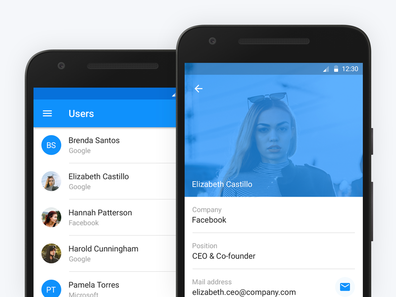

# HW_Week07_Day04_MVVM
The homework must be submitted before Sunday, November 28th at 9:00AM ⚠️

# What you'll build 📋
### In addition of your lab, you'll implement the following features:
#### Home screen:
- Will display a list of users 
- Each row will display the avatar, name, and email of the user

#### Profile screen:
- Choose an app and try to mimic its profile screen
- Will display the information of the user

The main purpose of the homework is to follow MVVM pattern

### UI Sample 

